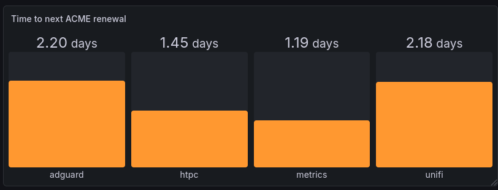

# Vicarian Metrics

Vicarian has built-in support for exporting Prometheus-compatible metrics. This documentation explains how to configure, scrape, and visualize these metrics.

## Configuration

Metrics are enabled by adding a backend with the `module://metrics` URL. This allows you to serve metrics on a specific path (e.g., `/metrics`) and optionally protect them with an `auth_key`.

### Example Configuration

```corn
{
    vhosts = [
        {
            hostname = "example.com"
            // ... TLS configuration ...

            backends = [
                {
                    context = "/metrics"
                    url = "module://metrics"
                    // Optional: require "Authorization: Bearer secret_key"
                    auth_key = "secret_key"
                }
            ]
        }
    ]
}
```

## Scraping with Prometheus

Once enabled, metrics can be scraped by Prometheus. As metrics are served over
HTTPS ensure you configure the scheme and target correctly:

```yaml
scrape_configs:
  - job_name: 'vicarian'
    scheme: https
    static_configs:
      - targets: ['example.com:443']
```

## Visualizing with Grafana

The number of metrics is small but provides essential health and status information.

### ACME Renewal Monitoring

One particularly useful metric is `vicarian_acme_next_renewal_timestamp_secs`, which provides the Unix timestamp for the next ACME/Let's Encrypt renewal.

To visualize the time remaining until renewal in Grafana:

1. Create a new panel.
2. Use the following Prometheus query:
   ```promql
   vicarian_acme_next_renewal_timestamp_secs - time()
   ```
3. Set the panel type to **Bar Gauge**.
4. Set the **Unit** to `Duration (s)` or similar.



## Available Metrics

The following metrics are currently exported:

- `vicarian_http_requests_total`: Total number of HTTP requests received.
- `vicarian_tls_requests_total`: Total number of TLS requests received.
- `vicarian_http_redirects_total`: Total number of HTTP to HTTPS redirects.
- `vicarian_metrics_scrape_total`: Total number of times the metrics endpoint has been scraped.
- `vicarian_acme_http01_endpoint_total`: Total number of ACME HTTP-01 challenge requests received.
- `vicarian_acme_http01_notfound_total`: Total number of ACME HTTP-01 challenge requests that were not found.
- `vicarian_acme_next_renewal_timestamp_secs`: Unix timestamp of the next expected ACME certificate renewal.
- `vicarian_auth_valid_total`: Total number of requests with a valid authorization header.
- `vicarian_auth_invalid_total`: Total number of requests with an invalid or missing authorization header (for backends where it's required).
